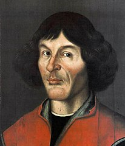

\introduction

<!-- Introduction text goes here. -->
<!-- You can change the name of the section if neccessary using `\introduction[modified heading]`. -->

<!-- The following settings can or must be configured in the header of this file and are bespoke for Copernicus manuscripts: -->

<!-- - The `journal` you are submitting to using the official abbreviation. You can use the function `rticles::copernicus_journal_abbreviations(name = '...')` to search the existing journals. -->

<!-- - Specific sections of the manuscript: -->

<!--   - `running` with `title` and `author` -->

<!--   - `competinginterests` -->

<!--   - `copyrightstatement` (optional) -->

<!--   - `availability` (strongly recommended if any used), one of `code`, `data`, or `codedata` -->

<!--   - `authorcontribution` -->

<!--   - `disclaimer` -->

<!--   - `acknowledgements` -->

<!-- See the defaults and examples from the skeleton and the official Copernicus documentation for details. -->

<!-- **Important**: Always double-check with the official manuscript preparation guidelines at [https://publications.copernicus.org/for_authors/manuscript_preparation.html](https://publications.copernicus.org/for_authors/manuscript_preparation.html), especially the sections "Technical instructions for LaTeX" and "Manuscript composition". -->
<!-- Please contact Daniel Nüst, `daniel.nuest@uni-muenster.de`, with any problems. -->

## Background


Quantifying chronological uncertainties, and how they influence the understanding of past changes in Earth systems, is a unique and fundamental challenge of the paleogeosciences. 
Without robust error determination, it is impossible to properly assess the extent to which past changes occurred simultaneously across regions, accurately estimate rates of change or the duration of abrupt events, or attribute causality -- all of which limit our capacity to apply paleoscientific understanding to modern and future processes.
The need for better solutions to both characterize uncertainty, and to explicitly evaluate how age uncertainty impacts the the interpretation of records of past climate, ecology or landscapes, has been long recognized [@Noren2013, (more)]. 
In response to this need, the paleogeoscience community has made substantial advances toward improving geochronological accuracy by:

1. Improving analytical techniques that allow for more precise age determination on smaller and context-specific samples [@Brown_radiocarbon89,@Eglinton96,@Fifield2000,@Eggins2005,@Santos_blank_2010]

2. Refining our understanding of how past changes in the Earth system impact the age accuracy, for example: improvements to the radiocarbon calibration curve [@Stuiver91,@Stuiver98,@Reimer04,@Reimer09] and advances in our understanding of spatial variability in cosmogenic production rates used in exposure dating [@Balco2009,@Masarik2009].

3. Dramatic improvement in the level of sophistication and realism in age-depth models used to estimate the ages of sequences between dated samples [e.g. @Ramsey2009Bayesian, @parnell2008flexible, @Blaauw2010CLAM, @Blaauw2011BACON].

Over the past 20 years, these advances have been widely adopted in the paleogeosciences, albeit partially so. 
Indeed, despite the progress made in quantifying uncertainty in both ages determinations and age models, few studies have formally evaluated how chronological uncertainty may have affected the inferences made from them. 
For instance, whereas the aforemention algorithms have been broadly used, the overwhelming majority of these studies calculate the single best-estimate model (often a median or mean), use this model to put measured paleoclimatic or paleoenvironmental data on a timescale, and then proceed to analyze the record with little to no reference to the age modeling exercise [@McKay2008,@McKay2009]. In addition, few studies have evaluated sensitivity to the choice of age modeling technique or choice of parameters, so that 
the typical discussion of chronological uncertainties remain qualitative.

This paradigm is beginning to change. 
In recent years, a handful of studies have taken advantage of approaches that generate ensembles of age models to evaluate how the results of their analyses and conclusions vary given differences between ensemble members [@Haam_Huybers2010,@Rhines_JGR2011,@Anchukaitis_Tierney2012,@Shakun_Nature2012,@Marcott_Science2013, @Tierney2013]. 
By using each ensemble age model to create a time-uncertain ensemble records, and then carrying that ensemble through the analysis, the precise impact of age uncertainty can be formally evaluated. 
This approach, of course, does not address all aspects of uncertainty, but it does offer the broad potential to ascertain which results are robust to chronological uncertainty, and which are not.

Despite its potential to substantially improve uncertainty quantification for the paleogeosciences, this framework is not widely utilized. 
The majority of studies utilizing this approach have been regional [e.g., @Anchukaitis_Tierney2012,@Tierney2013,@mckay_onset_2018, @routson2018} or global-scale [e.g., @Shakun_Nature2012,@Marcott_Science2013,@kaufman2020HoloceneGMST] syntheses.
Occasionally, primary publications of new records incorporate time-uncertain analysis into their studies [@Boldt2015,more], but this remains rare. 
We suggest that there are several reasons for the lack of adoption of these techniques:

1. For synthesis studies, the necessary geochronological data are not publicly available for the vast majority of records. Even when they are available, the data are archived in diverse and unstructured data formats. Together, this makes what should be a simple process of aggregating and preparing data for analysis prohibitively time-consuming;

2. For studies of new and individual records, few tools for ensemble analysis are available, and those that are require a degree of comfort with coding languages and scientific programming that is rare among paleogeoscientists;

3. There is a disconnect between age-model development and time-uncertain analysis. Published approaches have utilized either simplified age-modeling approaches [@Haam_Huybers2010], or specialized approaches not used elsewhere in the community [@Shakun_Nature2012,@Anchukaitis_Tierney2012,@Marcott_Science2013,@Tierney2013,@routson2018]. 

Extracting the relevant data from commonly-used age-modelling algorithms, creating time-uncertain ensembles, then reformatting those data for analysis in available tools typically requires the development of extensive custom codes. An integrative approach is needed to facilitate this work.  

## Design principles

GeoChronR was built to lower the barriers to broader adoption of these emerging methods, particularly for Quaternary records, for which a variety of chronostratigraphic methods are available: radiometric dating (${}^{14}\mathrm{C}, {}^{210}\mathrm{Pb}$, U/Th), exposure dating, layer-counting, flow models (for ice cores), etc. The primary uncertainty quantification device is age ensembles, regardless of how they were produced. As such, GeoChronR's philosphy and methods are expected to be more broadly applicable than Quaternary problems.

GeoChronR provides an easily-accessibly, open-source and extensible software package of industry-standard and cutting-edge tools that provides users with a single environment to create, analyze, and visualize time-uncertain data.
GeoChronR is designed around emerging standards in the paleogeosciences that connects users to growing libraries of standardized datasets formatted in the Linked PaleoData format [@LiPD] and [@neotoma]. The code re-uses existing community packages, for which it builds a standardized interface, with LiPD as input/output format. Central to the development of the code and documentation was feedback from two workshops carried in out in 2016 and 2017 at Northern Arizona Univeristy (14 and 19 participants). The workshops principally gathered early career researchers with $>50\%$  participation of underrepresented minorities.   Exit surveys were conducted to gather feedback, pointing to the need for a detailed documentation and examples, which this article partially fulfills. 

## Outline of manuscript

This manuscript describes the design, analytical underpinnings and most common use cases of GeoChronR.
Section \@ref(sec:age-modeling) describes the integration of age modelling algorithms with GeoChronR.
Section \@ref(sec:age-uncertain-analysis) details the methods implemented for age uncertain analysis.
Section \@ref(sec:visualization) goes through the principles and implementation of age-uncertain data visualization in GeoChronR, and section \@ref(sec:use-cases) provides five real-world examples of how GeoChronR can be used for paleoscientific workflows.


<!-- Age modeling section -->


# Age Uncertainty Quantification in GeoChronR {#sec:age-modeling}

GeoChronR does not introduce any new approaches to age uncertainty quantification; rather, it integrates existing, widely-used packages while streamlining the acquisition of age ensemble members. 
Fundamentally, there are two types of age models used in the paleogeosciences: tie-point and layer-counted. 
Most of the effort in age uncertainty quantification in the community has been focused on tie-point modelling, where the goal is to estimate ages (and their uncertainties) along a depth profile given chronological estimates (and their uncertainties) at multiple depths downcore.
Over the past 20 years, these algorithms have progressed from linear or polynomial regressions with simple characterizations of uncertainty [@clam, @heegaard05] to more rigorous techniques, particularly Bayesian approaches: as of writing, the three most widely used algorithms are Bacon [@bacon], BChron [@parnell2008flexible], and OxCal [@ramsey2008deposition], which are all Bayesian age-deposition models that estimate posterior distributions on age-depth relationships using different assumptions and methodologies.
@trachsel2017 reviewed the performance of these three algorithms, as well as a non-Bayesian approach [@clam], and found that the three Bayesian approaches generally outperform previous algorithms, especially when appropriate parameters are chosen (although choosing appropriate parameters can be challenging).
Bacon, BChron and Oxcal all leverage Monte Carlo Markov Chain (MCMC) techniques to sample the posterior distributions, thereby quantifiying age uncertainties as a function of depth in the section.
GeoChronR interfaces with each of these algorithms through their R packages [@baconPackage,@oxcAAR] (cite other R Packages), streamlining input and output. %data input and the extraction of the age ensembles from the MCMC results for further analysis.

In addition to working with ensembles from tie-point age models, GeoChronR connects users to probabilistic models of layer-counted chronologies. 
BAM [@BAM] was designed to probabilistically simulate counting uncertainty in banded archives, such as corals, ice cores, or varved sediments, but can be used to crudely simulate age uncertainty for any record, and is useful when the data or metadata required to calculate an age-depth model are unavailable. Here we briefly describe the theoretical basis and applications of each of the four approaches integrated in GeoChronR. 

## Bacon

The Bayesian ACcumulatiON (Bacon) algorithm  [@bacon] is one of the most broadly used age-modelling techniques, and was designed to take advantage of prior knowledge about the distribution and autocorrelation structure of sedimentation rates in a sequence to better quantify uncertainty between dated levels.
The algorithm employs an adaptive Markov Chain Monte Carlo algorithm that allows for Bayesian learning to update the sedimentation rate distribution. 
Bacon has two key parameters: the shape of the accumulation prior, and the segment length, which can interact in complicaed ways [@trachsel2017]. 
In our experience, the segment length parameter has the greatest impact on the ultimate shape and amount of uncertainty simulated by Bacon, as larger segments result in increased flexibility of the age-depth curve, and increased uncertainty between dated levels. 
Bacon is written in C++ and R, with an R interface.
More recently, the authors released an R package `rbacon` [@baconPackage], which GeoChronR leverages to provide access to the algorithm.
Bacon will optionally return a subset of the MCMC accumulation rate ensemble members with high *a posteriori* probabilities, which GeoChronR uses to form age ensemble members for subsequent analysis. 


maybe comment on the depositional model?

## BChron

BChron [@bchron,@parnell2008flexible] uses a similar approach, using a continuous Markov monotone stochastic process coupled to a piecewise linear deposition model. This simplicity allows semi-analytical solutions that make BChron computationally efficient.  BChron was originally intended to model radiocarbon-based age-depth models in lake sedimentary cores of primarily Holocene age, but its design allows broader applications. In particular, modeling accumulation as additive independent gamma increments is appealing for the representation of hiatuses, particulary for speleothem records, where accumulation rate can vary quite abruptly between quiescient intervals of near-constant accumulation [@Parnell_QSR2011,@PRYSM,@Hu_epsl17]. The downside of this assumption is that BChron is known to exaggerate age uncertainties in cases where sedimentation varies smoothly [@trachsel2017]. 

Bchron has several key parameters which allow a user to encode their specific knowledge about their data. In particular, the `outlierProbs` parameter is useful in giving less weigth to chronological tie points that may be considered outliers either because they create a reversal in the stratigraphic sequence or they are flagged during analysis (e.g. contamination). The `extractDate` parameter allows to set the top age of the sample. This is extremely useful for radiocarbon-based chronologies where the top age may not be accurately measured for modern samples. The `thetaMhSd`, `psiMhSd`, and `muMhSd` paraemeters constrol the Metroplois-Hastings standard deviation for the age parameters and Compund Poisson-Gamma scale and mean respectively, which influence the width of the ensemble between age control tie points. 

## Oxcal

The OxCal software package has a long history and extensive tools for the statistical treatment of radiocarbon and other geochronological data [@BronkRamsey95].
In @ramsey2008deposition, age-depth modelling was introduced with three options for modelling depositional processes that are typically useful for sedimentary sequences: uniform, varve, and Poisson deposition models, labeled U-sequence, V-sequence and P-sequence, respectively.
The Poisson-based model is the most broadly applicable for sedimentary, or other accumulation-based archives (e.g. speleothems), and although any sequence type can be used in GeoChronR, most users will use a P-sequence, which is the default. 
Analagously to segment length parameter in Bacon, the *k* parameter (called "eventsPerUnitLength" in GeoChronR), controls how many events are simulated per unit of depth, and has a strong impact on the flexibility of the model, as well as the amplitude of the resulting uncertainty. 
As the number of events increases, the flexibility of the model, and the uncertainties decrease.
@trachsel2017 found that this parameter has large impact on the accuracy of the model, and moreso than the choices made in Bacon or Bchron.
Fortunately, @bronkramsey2010 made it possible for *k* to be treated as a variable, and the model will estimate the most likely values of *k* given a prior estimate and the data, however this calculation can greatly increase the convergence time of the model.
Oxcal is written in C++, with an interface in R [@oxcAAR].
Oxcal doesn't calculate posterior ensembles for a depth sequence, but can optionally output MCMC posteriors at specified levels in the sequence.
GeoChronR uses this feature to extract ensemble members for subsequent analysis. 


## Banded Age Model (BAM)

@BAM is a probabilistic model of age errors in layer-counted chronologies. 
The model allows a flexible parametric representation of such errors (either as Poisson or Bernoulli processes), and separately considers the possibility of double-counting or missing a band. 
The model is parameterized in terms of the error rates associated with each event, which are intuitive parameters to paleogeoscientists, and may be estimated via replication [@DeLong_Paleo3_2013]. 
In cases where such rates can be estimated from the data alone, an optimization principle may be used to identify a more likely age model when a high-frequency common signal can be used as a clock [@BAM].
As of now, BAM does not consider uncertainties about such parameters, representing a weakness of the method. 
Bayesian generalizations have been proposed [@BoersCP2017], which could one day be incorporated into GeoChronR if the code is made public. 
BAM was coded in MATLAB and R, and it is this latter version that GeoChronR uses.

## Storage
GeoChronR archives the outcome of all of these models using in the LiPD format [@lipd_cp].
One of the primary motivations for LiPD was to facilitate age-uncertain analysis, and GeoChronR is designed to leverage these capabilities.
LiPD can store multiple chronologies (called "chronData" in LiPD), each of which can contain multiple measurement tables (which house the measured chronological data) and any number of chronological models (which archive metadata about the method used to create the model, and the results produced by the model) \@ref(fig:lipd-chron).
In LiPD, chronological models include up to three types of tables:

1. Ensemble tables, which store the output of an algorithm that produces age model ensembles, and a reference column (typically depth),

2. Summary tables, which describe summary statistics produced by the algorithm (e.g., median and 2$\sigma$ uncertainty ranges), and

3. Distribution tables, which store age-probability distributions for calibrated ages, typically only used for calibrated radiocarbon ages. 

The capability of GeoChronR to structure the output of the popular age model algorithms described in this section into LiPD is a key value proposition of GeoChronR.
Once in LiPD, these data and models can be written to a file and are readily analyzed, shared abd publicly archived.

```{r lipd-chron, out.width = "8.3cm", echo = FALSE, fig.cap = "one column figure"}

```

<!-- Analysis section -->


# Age-uncertain data analysis in GeoChronR {#sec:age-uncertain-analysis}

Some theoretical work has attempted to quantify how chronological uncertainty may affect various paleoscientific inferences [e.g. @HuybersWunsch2004]; however, such an approach is necessarily piecemeal, and therefore impractical given the variety of age-uncertainty structures in real-world paleogeoscientific data.
Consequently, GeoChronR follows a pragmatic and broadly-used approach that leverages age ensembles, and optionally ensembles in climate proxy or paleoenvironmental data, to propagate uncertainties through all steps of an analysis.
Effectively, this is done by randomly sampling from the ensemble(s) and then repeating the analysis on each sample (typically hundreds to thousands) to build an output ensemble that quantifies the impact of those uncertainties on a particular inference.
These output ensembles often do not lend themselves to binary significance statistics (e.g., a p-value below), but are readily used to provide quantiles that estimate probability density ranges, and can provide strong evidence for which results are robust to age and proxy uncertainty (and which are not).
Version 1.0.0 of GeoChronR has implemented ensemble analytical techniques for four of the most common analyses in the paleogeosciences: correlation, regression, spectral and principal component analyses. 

## Correlation

Pearson's product-moment correlation is the most common measure of a relationship between variables.  
Its computation is fast, lending itself to ensemble analysis, with a handful of pretreatment and significance considerations that are relevant for ensembles of paleogeoscientific data.
First, correlation analysis for timeseries is built on the assumption the datasets can be aligned on a common timeline. 
Age-uncertain data violate this assumption.
We overcome this by treating each ensemble member from one or more age uncertain timeseries as valid for that iteration, then "bin" each of the timeseries into coeval intervals.
The "binning" procedure in GeoChronR sets up an interval, which is typical evenly spaced, over which the data are averaged.
Generally, this intentionally degrades the median resolution of the timeseries, for example, a timeseries with 37-year median spacing could be reasonably "binned" into 100- or 200-year bins.
The binning procedure is repeated for each ensemble member, meaning that between different ensembles, different observations will be placed in different bins.

Following binning, Pearson correlation is calculated and recorded for each ensemble member. 
In addition to the correlation coefficients, GeoChronR calculates their significance for each correlation. 
Paleogeoscientific timeseries are often highly autocorrelated, which can lead to spurious assessments of significance [@Hu_epsl17]. 
Therefore, in addition to the standard Student's T-test p-value calculation, we also calculate a p-value that is adjusted for autocorrelation to reflect the reduction in degrees of freedom due to autocorrelation following @bretherton1999. 
However, repeating this test over multiple ensembles raises the issue of test multiplicity  [@Ventura2004], or "look elsewhere effect". 
To overcome this problem, we control for this false discovery rate using the simple approach of @BenjaminiHochberg95, coded in R by @Ventura2004. 
{Julien: thoughts} NM: I think here we need to discuss when FDR is needed, and when it's not. In my view, if you're surveying the full breadth on an ensemble, you're not searching for p-value, just trying to quantify the range. However, if the users want to subset some best-case or worst-case ensembles, and then proceed with analysis, FDR seems appropriate. 

## Regression

Linear regression is a commonly used tool to model the relationships between paleogeoscientific data and instrumental or other datasets.
One application is calibration-in-time [references], whereby a proxy timeseries is calibrated to an instrumental series with a linear regression model over their period of overlap.
This approach is particularly vulnerable to age uncertainties, as both the development of the relationship, and the reconstruction, are affected. 
GeoChronR propagates age (and optionally proxy) uncertainties through both the fitting of the ordinary least squares regression model, and the reconstruction "forecast" using the ensemble model results and age uncertainty.
Like the correlation algorithm, ensemble regression uses an ensemble binning procedure that's analgous to correlation.
GeoChronR then exports uncertainty structure of the modeled parameters (e.g. slope and intercept), as well as the ensemble of reconstructed calibrated data through time. 

## Principal Component Analysis

GeoChronR implements the age-uncertain principal component analysis (PCA) procedure introduced by @anchukaitis2013mceof, with some minor modifications and additions.
Like correlation and regression, PCA (or empirical orthogonal function {EOF} analysis) requires temporally aligned observations, and GeoChronR uses a binning procedure to achieve this across multiple ensembles.
This differs from the implementation of @anchukaitis2013mceof, who interpolated the data to a common timestep.
In addition, traditional singular value decomposition approaches to PCA require a complete set of observations without any missing values. 
For paleoclimate data, especially when considering age uncertainty, this requirement is often prohibitive. 
To overcome this, GeoChronR implements multiple options for PCA analysis using the `pcaMethods` package.
The default and most rigorously tested option is a probabilistic PCA (PPCA) approach that uses expectation maximization algorithms to infill missing values [@roweis1998algorithms]. 
This algorithm assumes that the data and their uncertainties are normally distributed, which is often (but not always) a reasonable assumption for paleogeoscientific data. 
As in correlation and regression, GeoChronR propagates uncertainties through the analysis by repeating the analysis across randomly sampled age and/or proxy ensemble members to build output ensembles of the loadings (eigenvectors), variance explained (eigenvalues) and principal component timeseries.
Because the sign of the loadings in PCA analyses is arbitrary and vulnerable to small changes in the input data, GeoChronR reorients the sign of the loadings for all PCs so that the mean of the loadings is positive. 
For well defined modes this effectively orients ensemble PCs, but loading orientation may be uncertain for lower order, or more uncertain, modes.

As in @anchukaitis2013mceof, we use a modified version of Preisendorfer’s "Rule N" [@PreisendorferMobley1988] to estimate which modes include more variability than those that can arise from random time series with comparable characteristics to the data. 
GeoChronR uses a rigorous "red" noise null hypothesis, modified from @SchneiderNeumaier2001, where following the selection of the age ensemble in each iterations, a synthetic autoregressive timeseries is simulated based on parameters fit from each dataset.
This means that the characteristics of the null timeseries, including the temporal spacing, autocorrelation and, optionally, the first order trend, match those of each dataset, and vary between locations and ensemble iterations.
For each iteration, the ensemble PCA procedure is replicated with the synthetic null dataset, using the same age ensemble member randomly selected for the real data.
This propagates the impact of age uncertainty into null hypothesis testing.
Following the analysis, the distribution of eigenvalues calculated by the ensemble PCA is typically compared with the 95th percentile of the synthetic eigenvalue results in a scree plot.
Only principle components whose eigenvalues exceed this threshold should be considered robust.


## Spectral Analysis {#sec:spec_theory}

Many research questions in the paleosciences revolve around spectral analysis: describing phase leads and lags among different climate system components over the Pleistocene [SPECMAP, @imbrie1984orbital], the hunt for astronomical cycles over the Holocene [@mill_monograph,@bond2001] or in deep time [@MeyersSageman_2007,@Meyers_2012,@Meyers_2015], or characterizing the continuum of climate variability [@Huybers_Curry2006,@ZhuPNAS2019]. 
Yet, spectral analysis in the paleosciences faces unique challenges: chronological uncertainties, of course, as well as uneven sampling, which violates the assumptions of classical spectral methods [@Ghil02]. 

To facilitate the quantification of chronological uncertainties in such assessments, GeoChronR implements four spectral approaches: 

1. the Lomb-Scargle periodogram [@VanderPlas_2018], which uses an inverse approach to harmonic analysis in unevenly-spaced timeseries.  

2. REDFIT, a version of the Lomb-Scargle periodogram tailored to paleoclimatic data [@SchulzMudelsee_02, @Mudelsee_02, @Mudelsee_NPG09]. 
The GeoChronR uses the implementation of REDFIT in the dplR package [@Bunn2008115].

3. the wavelet-based method of @Mathias_JSS04, called `nuspectral`. This method is quite similar to the Weighted Wavelet Z-transform algorithm of @Foster_AJ96, though it is prohibitively slow in this implementation, and the fast version using a compact-support approximations of the mother wavelet did not perform well in our tests. 

4. The multi-taper method (MTM) of @thomson82, a mainstay of spectral analysis [@Ghil02] designed for evenly spaced timseries. GeoChronR uses the implementation of MTM in @astrochron, which couples MTM to efficient linear interpolation, together with various utilities to define autoregressive and power-law benchmarks for spectral peaks. 
<!-- Viz section -->

# Visualization with GeoChronR {#sec:visualization}

One of the challenges with age-uncertain analysis is that it adds at least one additional dimension to the results, which can be challenging to visualize.
GeoChronR aims to facilitate simple creation of intuitive, publication-quality figures that provide multiple options for visualizing the impacts of age-uncertainty, while maintaining flexibility for users to customize their results as needed.
To meet the multiple constraints of simplicity, quality and customization, GeoChronR relies heavily on the `ggplot2` package [@ggplot2].
High-level plotting functions in GeoChronR (e.g., `plotTimeseriesEnsRibbons` and `plotPca`) produce complete figures as `ggplot2` objects, that can be readily customized by adding or changing `ggplot2` layers.
The figures in the Use Cases section (Section \@ref(sec:use-cases)) are all produced directly from GeoChronR without modification and generally fall into a few categories.

## Timeseries

The most common figure that users produce with GeoChronR are ensemble timeseries.
GeoChronR uses two complementary approaches to visualize these ensembles.
The first is the simplest, where a large subset of the ensemble members are plotted as semi-transparent lines.
This approach, implemented in `plotTimeseriesEnsLines`, provides a faithful representation of the data, while the overlapping semi transparency provides a qualitative sense of the ensemble uncertainty structure.
The second approach uses contours to more rigorlously visualize the structure of the time-value uncertainty space represented by the ensembles.
`plotTimeseriesEnsRibbons` shows the quantiles of the ensembles at specified levels as shaded bands. 
This approach provides the quantitative uncertainty structure, but tends to smooth out the apparent temporal evolution of the data. 
Fortunately, the two approaches are complementary, and often the best approach is to quantify the ensemble distribution with ribbons in the background, and then overlap them with a handful of ensemble lines to illustrate the structure in representive ensemble members.

## Maps

GeoChronR has simple mapping capabilities built in that rely on the `maps` [@maps] and `ggmap` [@ggmap] packages.
The `mapLipd` and `mapTs` functions provide quick geospatial visualization of one or more datasets, but also serve as the basis for the visualization of ensemble spatial data produced by ensemble PCA analyses.
In paleogeoscientific studies, the loadings (eigenvectors) of a PCA analysis are often portrayed as dots on a map, with a colorscale that highlights the sign and amplitude of the loadings.
In ensemble PCA, the additional dimension of uncertainty in the loadings needs to be visualized as well. 
In GeoChronR, the median of the loadings is shown as a color, and the size of the symbol is inversely proportional to the spread of uncertainty across the ensemble.
Consequently, large symbols depict loadings that are robust to the uncertainties, whereas small symbols show datasets whose loadings change substantially across the analysis.
An example is shown in Section \@ref(sec:pca)

## Spectra {#sec:spec_viz}

It is customary to plot spectra on a log-log scale, which helps separate close-by frequencies. This choice also naturally highlights scaling laws [@lovejoy2013weather,@ZhuPNAS2019] as linear structures in this reference frame. GeoChronR thus implements this convention. In addition, the abscissa ($\log_{10} f$) is labeled according to the corresponding period, which are more intuitive than frequency to scientists reading the plot. To help identify significant periodicities, confidence limits can be superimposed, based on user-specified benchmarks (see \@ref(sec:use-cases)). The `plotSpectrum()` function visualizes single ensemble members (e.g. a median age model), while `plotSpectraEns()` visualizes the quantiles of a distribution of age-uncertain spectra as ribbons, using the eponymous `ggplot` function. `periodAnnotate()` allows to manually highlight periods of interest, layered an existing plot. 


# Use cases {#sec:use-cases}

We now illustrate the use of these tools on five use cases. 
The first example shows how a user might create age ensembles on different archives, and how to visualize the timing of abrupt events with appropriate uncertainty quantification. 
The second example walks through ensemble correlation of age-uncertain records. 
The third introduces the topic of age-uncertain calibration-in-time. 
The fourth provides an example of regional age-uncertain principal components analyses, and the fifth deals with spectral analysis. 


## Creating an age ensemble 

A common first task when using geoChronR is to create an age ensemble, either because the user is developing a new record, or because the age ensemble data for the record they are interested is unavailable.
As described in section \@ref(sec:age-modeling), workflows for four published age quantification programs are integrated into geoChronR.
All four methods can be used simply in geoChronR with a LiPD file loaded into R that contains the chronological measurements, and the high-level functions `runBacon()`, `runBchron()`, `runOxcal()` and `runBam()`.
These functions take LiPD objects as inputs, and return updated LiPD objects that include age-ensemble data generated by the respective software packages, with these data stored in appropriate tables.
Typically, additional parameters are needed for to optimally run the algorithms.
When these parameters are not specified, geoChronR will run in interactive mode, asking the user which variables and parameters they would like to model.
These parameter choices are printed to the screen during while the program runs, or are available later with the function `getLastVarString()`.
By specifying these parameters, age model creation can be scripted and run in non-interactive mode.
In this use case, we'll use geoChronR and BChron [@parnell2008flexible] to calculate an age ensemble for the Hulu Cave $\delta^{18}$O speleothem record [@hulu2001], and BAM [@BAM] to simulate age uncertainties for the GISP2 ice core $\delta^{18}$O dataset [@alley].
The `plotChronEns()` function will plot an age-depth model and uncertainties derived from the age ensemble (figure \@ref(fig:age-model)).

```{r load-libraries, echo=FALSE,results='hide',warning = FALSE, message = FALSE}
library(lipdR)
library(geoChronR)
library(magrittr)
library(ggplot2)
library(dplyr)
library(purrr)
library(ggthemes)
library(astrochron)
```

```{r, echo=FALSE,results='hide',warning = FALSE, message = FALSE,cache=TRUE}
hulu <- lipdR::readLipd("http://lipdverse.org/geoChronR-examples/Hulucave.Wang.2001.lpd")

hulu <- runBchron(hulu,
                  cal.curves = "normal",
                  iter = 10000,
                  extractDate = 10000,
                  which.table = 2,
                  lab.id.var = NULL,
                  age.var = 'age',
                  age.uncertainty.var = 'ageUncertaintyHigh',
                  age.14c.var = NULL,
                  age.14c.uncertainty.var =  NULL,
                  depth.var = 'depth',
                  reservoir.age.14c.var = NULL,
                  reservoir.age.14c.uncertainty.var = NULL,
                  rejected.ages.var = NULL)
```

```{r, Hulu Chronology, echo=FALSE,results='hide',warning = FALSE, message = FALSE}
chronPlot <- plotChronEns(hulu,truncate.dist = 1e-6)+ggtitle(NULL)+coord_cartesian(xlim = c(80000,30000))
```

```{r age-model,out.width = "12cm",echo = FALSE,warning=FALSE,message = FALSE,fig.cap = "Age-depth model generated by BChron for a speleothem from Hulu Cave. Relative age probability distributions shown in purple. Median age-depth in black, with 50 and 95 percentile highest-density probability ranges shown in dark and light gray, respectively. Five random age-depth ensemble members shown in red."}
print(chronPlot)
```

After an age ensemble has been added to a LiPD object, the user can visualize the ensemble timeseries using `plotTimeseriesEnsRibbons()` and `plotTimeseriesEnsLines()`.
GISP2 $\delta^{18}$O is plotted with age uncertainty, using both functions, in figure \@ref(fig:timeseries).

```{r, echo=FALSE,results='hide',warning = FALSE, message = FALSE, cache= TRUE}
gisp2 <- lipdR::readLipd("http://lipdverse.org/geoChronR-examples/GISP2.Alley.2000.lpd")

gisp2 <- runBam(gisp2,
               paleo.num = 1,
               paleo.meas.table.num = 1,
               chron.num = 1,
               model.num = 1,
               ens.table.number = 1,
               make.new = T,
               n.ens = 1000,
               model = list(name = "poisson",
                            param = 0.02,
                            resize = 0,
                            ns = 1000)
               )
gisp2.d18O <- selectData(gisp2,var.name = "temp")

gisp2.ens <- selectData(gisp2,var.name = "yearEnsemble")
gisp2.ens <- convertAD2BP(gisp2.ens)
```


```{r timeseries,out.width = "12cm",echo = FALSE,warning=FALSE,message = FALSE,fig.cap = "Impact of age uncertainty on reconstructed temperature at GISP2 over the past 50,000 years. The median ensemble member is shown in black, with the 50 and 95 percent highest-density probability ranges shown in dark and light gray, respectively. Five random age-uncertain temperature ensemble members shown in red."}
plotTimeseriesEnsRibbons(X = gisp2.ens,Y = gisp2.d18O,n.bins = 500) %>% 
  plotTimeseriesEnsLines(X = gisp2.ens,Y = gisp2.d18O,n.ens.plot = 5,color = "Reds",alp = .2)+
  ggtitle(NULL)+xlab("Age (BP)")
```

## Correlation

Now that the user has generated age ensembles for the two datasets, they're interested to see if a correlation between the two datasets is robust to the age uncertainty modeled here.
On multi-millennial timescales, the two datasets dislay similar features, and previous work has suggested that abrupt events of the Last Glacial period, which are observed in the GISP2 record, can impact the Asian Monsoon and be observed is speleothem records such as the Hulu Cave dataset. (NM: add references)
The `corEns()` function in geoChronR will calculate ensemble correlations across age-uncertain datasets, such as these.
`corEns()` will also sample across ensembles in the proxy data as well, if present.
Here we calculate correlations during the period of overlap in 500 yr steps, determining significance for each pair of ensemble members while accounting for autocorrelation.

```{r, echo=FALSE,results='hide',warning = FALSE, message = FALSE,cache = TRUE}
hulu <- mapAgeEnsembleToPaleoData(hulu,age.var = "ageEnsemble",paleo.meas.table.num = 2)
hulu.ae <- selectData(hulu,var.name = "ageEnsemble",meas.table.num = 2)
hulu.d18O<- selectData(hulu,var.name = "d18O",meas.table.num = 2)
corout <- corEns(gisp2.ens,gisp2.d18O,hulu.ae,hulu.d18O,bin.step = 500,max.ens = 10000)
corPlot <- plotCorEns(corout,legend.position = c(0.1, 0.8),significance.option = "autocorr")+ggtitle(NULL)
```


```{r cor-hist,out.width = "8.3cm",echo = FALSE,warning=FALSE,message = FALSE,fig.cap = "Distribution of age-uncertain correlation between Hulu Cave speleothem and GISP2 ice core records. Significant (insignificant) correlations shown in green (gray).  Quantiles of the distribution shown in vertical red lines."}
print(corPlot)
```

```{r hulu self cor, echo=FALSE,results='hide',warning = FALSE, message = FALSE,cache = TRUE}
coroutHulu <- corEns(hulu.ae,hulu.d18O,hulu.ae,hulu.d18O,bin.step = 500,max.ens = 10000)
corPlotHulu <- plotCorEns(coroutHulu,legend.position = c(0.1, 0.8),significance.option = "autocorr")+ggtitle(NULL)

above90 <- round(sum(coroutHulu$cor.df$r > 0.9)/nrow(coroutHulu$cor.df)*100,1)
med <- round(median(coroutHulu$cor.df$r),2)

```


```{r hulu-cor-hist,out.width = "8.3cm",echo = FALSE,warning=FALSE,message = FALSE,fig.cap = "Distribution of age-uncertain correlation between Hulu Cave speleothem and itself, treating the age uncertainty as if independent. Style as in figure x."}
print(corPlotHulu)
 
```


The results are visualized as a histogram of the ensemble correlation results, with color shading to highlight significance (figure \@ref(fig:cor-hist)).
The two timeseries are consistently negative correlations, although `r round(sum(corout$cor.df$r>0)/nrow(corout$cor.df)*100,digits = 1)`% of the ensemble members are positive.
However, only `r round(sum(corout$cor.df$pSerial < 0.05)/nrow(corout$cor.df)*100,digits = 1)`% are significant after accounting for serial autocorrelation.
Given the age models and correlation parameters used here, it seems pretty unlikely that these two datasets are significantly correlated. 
However, it's worth noting that evaluating these results remains somewhat subjective, as there is no theoretical expectation for what fraction of ensemble correlation results should be expected to pass a significance test in age-uncertain correlation. 
Two timeseries, which are actually correlated, each with it's own age-uncertainty, will commonly return some fraction of insignificant results when random ensemble members are correlated against each other. 
The frequency of these "false negatives" depend on the structure of the age-uncertainties and the timeseries, and will vary to some extent by random chance. 
One way to get a sense of the vulnerability of a timeseries to false negatives is to perform an age-uncertain correlation of a dataset with itself.
It's appropriate to consider the results of this analysis a best-case scenario, and to consider the correlation results in this light.
For illustration, we perform this calculation with the Hulu Cave $\delta^{18}$O record (figure \@ref(hulu-cor-hist)).
The impact of age uncertainty on the correlation of this record is apparent; even when correlated against itself, only ```r above90```% of the ensembles have r-values greater than 0.9, and the median correlation is ```r med```.
However, all of the correlations remain significant, even after accounting for autocorrelation, indicating that age uncertainty and the structure of the timeseries does not preclude the possibility of significant correlations.
Generally, it's appropriate to think of the ensemble correlation results produced by GeoChronR as a first-order estimate of the age-uncertain correlation characteristics between timeseries, rather than a binary answer to the question "Are these two datasets correlated?".
However, as a rule of thumb, if more than half of the ensemble correlation results are significant, it is reasonable to characterize that as a correlation that is robust to age uncertainty.

## Age-uncertain Calibration
A natural extension of ensemble correlation is ensemble regression.
Although there are use cases where regressing one age-uncertain variable onto another is called for, here we regress an age-uncertain paleoclimate proxy onto time-certain instrumental to develop a calibration-in-time.
For this use case, we reproduce the results of @Boldt:2015, where the authors calibrated a spectral reflectance measure of chlorophyll abundance, relative absorption band depth (RABD), to instrumental temperature in Northern Alaska.
For each iteration in the analysis, a random age ensemble member is chosen and used to bin the RABD data onto a 3-year timescale. 
The instrumental temperature data, here taken from the nearest gridcell of the GISTEMP reanalysis product [@GISTEMP], are also binned onto the same timescale, insuring temporal alignment between the two timeseries.
GeoChronR then derives an ordinary linear regression model, and then uses that model to "predict" temperature values from 3-year-binned RABD data back in time.
This approach propagates the age uncertainties both through the regression and prediction process.


```{r regression model, echo=FALSE,results='hide',warning = FALSE, message = FALSE, cache = TRUE}
  library(readr)
K <- lipdR::readLipd("http://lipdverse.org/geochronr-examples/Kurupa.Boldt.2015.ens.lpd")
K <- mapAgeEnsembleToPaleoData(K,age.var = "ageEnsemble")
kae <-  selectData(K,"ageEnsemble")
rabd <- selectData(K,"RABD")
kurupa.instrumental <- readr::read_csv("http://lipdverse.org/geochronr-examples/KurupaInstrumental.csv")
kae = convertBP2AD(kae)

kyear = list()
kyear$values = kurupa.instrumental[,1]
kyear$variableName = "year"
kyear$units = "AD"

kinst = list()
kinst$values = kurupa.instrumental[,2]
kinst$variableName = "Temperature"
kinst$units = "deg (C)"

regout = regressEns(time.x = kae,
                    values.x = rabd,
                    time.y =kyear,
                    values.y =kinst,
                    bin.step=3,
                    recon.bin.vec = seq(-4010,2010,by=20))
```

```{r regression,out.width = "12cm",echo = FALSE,warning=FALSE,message = FALSE,fig.cap = "Need to write a caption"}
regPlots <- plotRegressEns(regout,alp = 0.01,font.size = 8)
```

The function `plotRegressEns` produces multiple plots that visualize the key results of age-uncertain regression, and additionally creates an overview "dashboard" that showcases the key results (figure \@ref(fig:regression)).
The first row of figure \@ref(fig:regression) illustrates the impact of age uncertainty on the regression modelling.
In this example, the distribution of the modeled parameters, the slope and intercept of the regression equation, show pronounced modes of their distributions near 150 $^\circ C^{-1}$ and $^\circ C$, respectively, but with pronounced tails that include models with much lower slopes.
This is also apparent in the scatterplot in the central panel of the top row, which illustrates the distribution of modeled relationships.
Although the tendency for robust relationships are clear, models with slopes near zero also occur, suggesting that in this use case, age uncertainty can effectively destroy the relationship with instrumental data.
The impact of this variability in modeled parameters, as well as the effects of age uncertainty on the timing of the reconstruction, are shown in the bottom panel of figure \@ref(fig:regression).
The results shown here are consistent with those presented by @Boldt:2015, and we refer readers to that study for a full discussion of the implications of their results. 

## Principle Component Analysis {#sec:pca}

Thus far, the use cases have highlighted age-uncertain analyses of one or two locations, however quantifying the effects of age uncertainty can be even more impactful over large spatial datasets. 
Here we showcase how to use geoChronR to perform age-uncertain principle components analysis (PCA), also known as Monte Carlo Empirical Orthogonal Function (MCEOF) analysis, pioneered by @anchukaitis2013mceof.
When seeking to analyze a large collection datasets, the first, and often most time-intensive, step is to track down, format and standardize the data. 
Fortunately, the emergence of community-curated standardized data collections [e.g. @Pages2013, @Pages2017, @Temp12k] can greatly simplify this challenge.
In this example, we examine the Arctic 2k database [@McKayKaufman2014], and use GeoChronR and the LiPD Utilities to filter the data for temperature-sensitive data with age ensembles relevant to the past 2000 years.

```{r, echo=FALSE,results='hide',warning = FALSE, message = FALSE, cache = TRUE}
FD <- readLipd("http://lipdverse.org/geoChronR-examples/arc2k/Arctic2k.zip") 
FD2 = purrr::map(FD,
                 mapAgeEnsembleToPaleoData,
                 strict.search = TRUE,
                 age.var = "ageEnsemble",
                 depth.var = NULL )
TS = extractTs(FD2)
TS.filtered = filterTs(TS,"interpretation1_variable == T")


tidyDf <- tidyTs(TS.filtered) %>% 
  arrange(archiveType)
```


```{r timeseries stack,out.width = "12cm",fig.height = 12,fig.width=8,echo = FALSE,warning = FALSE, message = FALSE,fig.cap = "Need to write a caption"}

plotTimeseriesStack(tidyDf, 
                    color.var = "paleoData_variableName", 
                    color.ramp = c("DarkBlue","Orange","Black","Dark Green"),
                    line.size = .1, 
                    fill.alpha = .05,
                    lab.size = 2,
                    lab.space = 3)+
  theme(legend.position = "bottom",text = element_text(size = 12))

```

Once filtered, the data can be visualized using `plotTimeseriesStack`, which is an option to quickly plot all of the timeseries, on their best-estimate age models, aligned on a common horizontal timescale (figure \@ref(timeseries-stack)).
Although all of the datasets are relevant to Arctic temperatures over the past 2000 years, they span different time intervals, with variable temporal resolution.
It is also clear that there is a lot of variability represented represented within the data, but it's difficult to visually extract shared patterns of variability.
Ensemble PCA is well-suited to the modes of variability that explain the most variance within these data, while accounting for the impact of age uncertainty.

As in correlation and regression, aligning the data onto a common timescale is required for ensemble PCA.
All but two of these datasets are annually resolved, and the other two have 5-year resolution, so it is reasonable to bin these data into 5 year bins.
Furthermore, because many of the records do not include data before 1400 CE, we only analyze the period from 1400 to 2000 CE.
The data are now prepared for the ensemble PCA calculation, following a few choices in methodology and parameters.
Because the data analyzed here have variable units, and we are not interested in the magnitude of the variance only the relative variability between the datasets,  we choose to use a correlation, rather than covariance, matrix.
Next, we choose the number of components to estimate. 
After the analysis, a scree plot is used to determine the number of significant components, so we want to estimate several more components than we anticipate will be meaningful.
For this use case we estimate eight components. 

We now conduct the ensemble PCA, including null hypothesis testing, for 100 ensemble members. 
For a final analysis, 1000 ensemble members is standard, however the analysis can be time consuming and 100 members is appropriate for initial analyses.
First, we plot the ensemble variance explained results for the data and the null hypothesis as a scree plot (figure \@ref(fig:scree)).
This represents how the variance explained by each component declines with each mode, for both the data and the null hypothesis. Due to age uncertainty, this variance explained is a distribution, which we compare to the 95th quantile of the null hypothesis ensemble.
Figure \@ref(fig:scree) indicates that the first two components are clearly distinguished from the null.
The third component is borderline, with the variance explained by the median of the ensemble near the null.
Therefore, we will focus our investigation on the first two modes.

```{r, echo=FALSE,results='hide',warning = FALSE, message = FALSE, cache = TRUE}
binned.TS = binTs(TS.filtered,bin.vec = seq(1400,2000,by=5),time.var = "ageEnsemble")
pcout = pcaEns(binned.TS,n.pcs = 8)
```

```{r scree,out.width = "8.3cm",echo = FALSE,warning = FALSE, message = FALSE,fig.cap = "Need to write a caption"}
scree <- plotScreeEns(pcout)+ ggtitle("Scree plot")
print(scree) 
```


```{r pca,out.width = "12cm",echo = FALSE,warning = FALSE, message = FALSE,fig.cap = "Need to write a caption"}
plotPCA <- plotPcaEns(pcout,
                      TS = TS.filtered,
                      map.type = "line",
                      projection = "stereo",
                      bound.circ = T,
                      restrict.map.range = T,
                      f=.1,
                      legend.position = c(0.5,.6),
                      which.pcs = 1:2,
                      which.leg = 2)+
  theme(text = element_text(size = 5))
```

The spatial and temporal results of the first two principle components are shown in figure (\@ref(fig:pca)).
The first PC is dominated by consistently positive loadings across the North Atlantic, suggesting that this is a regionally persistent mode of variability, and indicating that none of the datasets are negatively correlated with this mode.
The corresponding timeseries shows multidecadal variability, with values declining until the 18th Century, before increasing into the 20th century.
Based on the region-wide coherence of the loading pattern and the similarity of the timeseries to regional temperature reconstructions [@paico,@McKayKaufman2014,@wernerArcticCFR], the first PC likely reflects the primary pattern of regional temperature variability.
Notably, the uncertainties in the PC1 timeseries, and the loadings in the spatial pattern, are generally small.
This, combined with the large amount of variance explained by PC1 relative to the null hypothesis (figure \@ref(fig:scree)), suggests this is a significant mode of variabity that is robust to age uncertainty.
This makes intuitive sense, since the primary features of this pattern are century-long trends in temperature, a timescale that substantially exceeds the age uncertainty in these data [@McKayKaufman2014].

The second PC shows considerable more variability in its spatial loading pattern, and a larger impact of age uncertainty. 
Generally, the loadings suggest a north-south dipole over Greenland for this mode, with positive loadings present in much of southern Greenland, with negative loadings in present in much of the northern part of the region.
There is a much larger impact of age uncertainty on the loadings in PC2 than in PC1, illustrated by the size of the markers on the map, which are inversely related to the standard deviation of the loadings across the ensemble PCA results, such that smaller markers indicate larger uncertainties.
The PC2 timeseries includes more multidecadal variability than PC1 and is more impacted by age uncertainty.
A key feature of the timeseries is a peak in values in the late 20th century, which occurs after the pronounced peak in PC1.
This suggests that unlike the mid-20th century peak in warming apparent in most of the data, this later warming was dominated by contributions from southern Greenland, and counterbalanced by a decline in values in the northern Atlantic Arctic.


## Spectral Analysis {#sec:spec_vignette}

To illustrate the use of spectral analysis in GeoChronR, consider the following use case: a paleoceanographer wants to identify the relative energy of oscillations at orbital (Milankovitch) periodicities in a deep-sea sediment core, and quantify the impact of age uncertainties on this assessment. 
To do so, they select the benthic paleotemperature record of the International Ocean Drilling Project core 846 [@mix1995benthic, @Shackleton95], covering the past 4.7 million years. 
For this assessment, we use a new age model obtained by alignment to the benthic $\delta^{18}\mathrm{O}$ stack of @LisieckiRaymo05 using the HMM-Match algorithm [@ProbStack,@Khider_2017]. 
HMM-Match is a probabilistic method that generates an ensemble of 1000 possible age models compatible with the chronostratigraphic constraints; this ensemble was archived as a table in the associated [LiPD file](http://lipdverse.org/geoChronR-examples/ODP846.Lawrence.2006.lpd).

Now let us take a first look at the median age model:

```{r, echo=FALSE,results='hide',warning = FALSE, message = FALSE, cache = TRUE}
I <- lipdR::readLipd("http://lipdverse.org/geoChronR-examples/ODP846.Lawrence.2006.lpd")
d18O <- I$chronData[[1]]$model[[1]]$summaryTable[[1]]$d180$values
t.med <- I$chronData[[1]]$model[[1]]$summaryTable[[1]]$median$values
L <- geoChronR::mapAgeEnsembleToPaleoData(I,paleo.meas.table.num = 1)
age = geoChronR::selectData(L,"ageEnsemble",meas.table.num = 1)
temp = geoChronR::selectData(L,"temp muller",meas.table.num = 1)
age.median = matrixStats::rowQuantiles(age$values,probs = 0.5)

time = age$values[age.median < 1000,]  # age ensemble for ~ last 1 Ma
values = temp$values[age.median < 1000]
```


```{r,out.width = "12cm",echo = FALSE, results='hide', warning = FALSE, message = FALSE,fig.cap = "Temperature reconstruction from IODP 846"}
tsPlot <- geoChronR::plotTimeseriesEnsRibbons(ggplot(),X=age,Y=temp,line.width = 0.5,alp=1) + 
  scale_x_reverse() 
print(tsPlot)
```

This record displays three salient features:

- a long-term cooling trend characteristic of the late Neogene and Quaternary climate. 

- quasi-periodic oscillations (the legendary Pleistocene Ice Ages)

- nonstationary behavior, related to the well-known mid-Pleistocene transition from a "41k world" to a "100k world" somewhere around 0.8 Ma [@Paillard_2001]. 

For tractability, let us focus on the last million years, which cover the Quaternary Era. Over this interval, the time increments ($\Delta t$) are sharply peaked around 2.5 ka, spanning 0 to about 7.5 ka. From this point there are two ways to proceed: 1) use methods that explictly deal with unevenly-spaced data, or 2) interpolate to a regular grid and apply standard methods (see \@ref(sec:spec_theory)). 
Though GeoChronR supports four different methods, we will highlight only two here: REDFIT and MTM.

```{r ensemble-mode REDFIT, cache = TRUE, echo = FALSE, results='hide', warning = FALSE, message = FALSE}
spec.redfit.ens <- computeSpectraEns(time,values,max.ens = 1000, method = 'redfit')
cl.ens.df     <- data.frame("freq" = spec.redfit.ens$freq, "pwr95" = spec.redfit.ens$power.CL) # store confidence limits
names(cl.ens.df)[2] <- "95% CL"

p.redfit.ens <- plotSpectraEns(spec.ens = spec.redfit.ens, cl.df = cl.ens.df,
                               x.lims = c(10,150), y.lims = c(0.1,1000)) +
  ggtitle("IODP 846 age ensemble, REDFIT") + xlab("Period (ky)")
# label periodicities of interest
p.redfit.ens <- periodAnnotate(p.redfit.ens, periods = c(19,23,41,100), y.lims =c(0.1,300))
#show(p.redfit.ens)
```

```{r redfit plot, out.width = "12cm", echo = FALSE,warning=FALSE,message = FALSE,fig.cap = "REDFIT spectrum for IODP 846, 1000-member age ensemble"}
print(p.redfit.ens)
```

It is clear that the data contain significant energy (peaks) near, but not exactly at, the Milankovitch periodicities (100, 41, 23, and 19 kyr).  
These periodicities (particularly the eccentricity (100kyr) and precessional (23 and 19 kyr)) rise above the null (the 95% quantile from an autoregressive process of order one, see @Mudelsee_NPG09). 
The obliquity periodicity is relatively weak, reaching just below the AR(1) benchmark.

The Lomb-Scargle periodogram used by REDFIT is a common way to deal with unevenly-spaced timeseries, but like all periodograms, it is inconsistent: the variance (uncertainty) of spectral density at each frequency does not decrease with the number of observations. This is mitigated somewhat with the application of Welch's Overlapping Segment Averaging, but their parameter choice is fairly arbitrary. 
On the other hand, MTM [@thomson82] is an optimal estimator, which is consistent (the more obervations, the better constrained the spectral density). 
Formally, MTM optimizes the classic bias-variance tradeoff inherent to all statistical inference. 
It does so by minimizing speactral leakage outside of a frequency band with half-bandwidth equal to $pf_R$, where $f_R=1/(N \Delta t)$ is the Rayleigh frequency, $\Delta t$ is the sampling interval, $N$ the number of measurements, and $p$ is the so-called *time-bandwidth product* [@Ghil02]. 
$p$ can only take a finite number of values, all multiples of 1/2 between 2 and 4. 
A larger $p$ means lower variance (i.e. less uncertainty about the power), but broader peaks (i.e. a lower spectral resolution), synonymous with more uncerainty about the exact location of the peak. 
So while MTM might not distinguish between closely-spaced harmonics, it is much less likely to identify spurious peaks, especially at high frequencies. 
In addition, a battery of formal tests have been devised with MTM, allowing to ascertain the significance of spectral peaks under reasonably broad assumptions. We show how to use this "harmonic F-test" below.

However, the classic version of MTM can only handle evenly-spaced data. Since the data are close to evenly-spaced, is is reasonable to interpolate them using standard methods. Both interpolation and MTM are implemented with the [astrochron @astrochron] package, which GeoChronR re-uses.

```{r ensemble-mode MTM, cache = TRUE, echo = FALSE, results='hide', warning = FALSE, message = FALSE}
dti = 2.5  # interpolation interval, corresponding to the mode of the \Delta t distribution
tbw = 2  #time-bandwidth product for the analysis; we use the minimum allowed to limit smoothing. 

mtm.ens.spec <-  computeSpectraEns(time,values,
                                   max.ens = 1000,
                                   method = 'mtm',
                                   tbw=tbw, padfac=5,
                                   mtm_null = 'AR(1)')

ar1.df <- data.frame(mtm.ens.spec$freqs,mtm.ens.spec$power.CL)
# rename columns to be less silly
names(ar1.df)[1] <- "freq"
names(ar1.df)[2] <- "95% CL"

p.mtm.ens <- plotSpectraEns(spec.ens = mtm.ens.spec, cl.df = ar1.df, 
                            x.lims = c(10,150), y.lims = c(1e-5,1e-1)) + 
             ggtitle("IODP 846 age ensemble, MTM") + xlab("Period (ky)")

# label periodicities of interest
p.mtm.ens <- periodAnnotate(p.mtm.ens, periods = c(19,23,41,100), y.lims =c(1e-5,0.05))
#show(p.mtm.ens)
```

To this we can add the periods identified as significant by MTM's F ratio test. 
GeoChronR estimates this by computing the fraction of ensemble members that exhbit a significant peak at each frequency. 
One simple criterion for gauging the level of support for such peaks given age uncertainties is to pick out those periodicities that are identified as significant above a certain threshold (say, more than 50% of the time).  For consistency with REDFIT, we define the null as an AR(1) process fit to the data, but GeoChronR supports two other nulls: a power-law null and a fit to the spectral background [@MannLees96]. 
Both follow the `astrochron` implementation. 
```{r MTM ensemble, echo = FALSE, results='hide', warning = FALSE, message = FALSE}

per = 1/ar1.df$freq
sig_per =  which(mtm.ens.spec$sig.freq>0.5)
p.mtm.ens <- periodAnnotate(p.mtm.ens, periods = per[sig_per],color = "blue",y.lims = c(1e-5,5e-4))
```

```{r MTM ensemble export,out.width = "12cm",echo = FALSE,warning=FALSE,message = FALSE,fig.cap = "MTM spectrum for IODP 846, 1000-member age ensemble. In orange are the Milankovitch frequencies and we label in blue the periodicities identified as significant by the test."}
print(p.mtm.ens)
```

You may notice a few differences to the REDFIT estimate. First, this ensemble of spectra exhibits a clear power law behavior from periods of 5 to 100 ky, which in this log-log plotting convention manifests as a linear decrease. This is part of the well-documented continuum of climate variability [@Huybers_Curry2006,@ZhuPNAS2019], which is conspicuously absent from the Lomb-Scargle (REDFIT) estimate, known to be extremely biased in its estimate of the spectral background. 


<!-- *Astrochron* implements several tests to detect harmonic (sinusoidal) components. Like all tests, they are heavily dependent on a null hypothesis. By default, *astrochron::mtm()* assumes that we test against an AR(1) model. Using the option `output = 2`, it will export the frequencies identified as "significant" by this procedure. In this case, it roughly identifies the Milankovitch frequencies we expected to find, plus many others. What should we make of that? The 100ka cycle is now labeled as 90 ka, though given the peak's width, one should not be foolish enough to consider them distinct. There is also evidence that this peak may be the result of ice ages clustering every 2 to 3 obliquity cycles (81 or 123 ka), averaging around 100 over the pleistocene [@HuybersWunsch2005]. Bottom line: with such spectral resolution, 94 and 100 are one and the same, and may really be a mixture of 80 and 120.  Overall, this test identifies 8 periodicities as significant, compared to the 4 we'd expect. -->

Secondly, the MTM version with this time-bandwidth product is sharper than REDFIT, with more well-defined peaks, particularly for the obliquity period (41 ky), which pokes well above the 95\% confidence limit. Here it is helpful to take a step back and contemplate our null hypothesis of AR(1) background, and the possibility that we might be underestimating the lag-1 autocorrelation, hence making the test too lenient. More importantly, the presence of scaling behavior (power law decrease) suggests that this should be a more appropriate null against which to test the emergence of spectral peaks. In GeoChronR, this can be done by specifying `mtm_null = "power_law` in the function call. 

This may get rid of a few cycles, but many remain (not shown). However, carrying out a test simultaneously at many periodicities is bound to affect assesments of significance, via the multiple comparisons problem [@Vaughan_PP2011]. In addition, sedimentary processes (and many processes in other proxy archives) tend to smooth out the signal over the depth axis, making comparisons at neighboring frequencies highly dependent [@Meyers_2012]. One solution is to use predictions made by a physical model about the frequency and relative amplitude of astronomical cycles [@MeyersSageman_2007]. While this may not be applicable to all spectral detection problems, GeoChronR does not implement "cookie-cutter" solutions, to force the user to think deeply about the null hypothesis and the most sensible way to test it. Readers are invited to consider the following references for a deeper exploration of these questions: @Vaughan_PP2011, @Meyers_2012, @Meyers_2015, @MeyersMalinverno2018. 

As with all statistical analyses in the paleosciences, there are no universal solutions or parameter choices. 
The approaches implemented in GeoChronR, especially with default choices, are best considered as exploratory tools, that provide insight into the impacts of age uncertainty on power spectra, and to help users to tailor their null hypotheses to their scientific questions.

<!-- There are four main takeways from this example: -->

<!-- 1. GeoChronR implements 4 different spectral methods, with different features and assumptions. This allows users to explore whether results obtained with one method are robust to these choices.  More details of the implementation are provided in the vignette "spectral_analysis" that accompanies the package. -->

<!-- 2. The methods are enabled for single age models, as well as age ensembles. -->

<!-- 3. The choice of null hypothesis is always highly consequential, and should be made with care. -->

<!-- 4. Hunting for astronomical (or other) frequencies in paleoclimate timeseries takes extreme care, and cannot be answered in one function call. In this particular example where the data are nearly evenly spaced, and interpolation has a negligible impact, the best choice is MTM for two reasons: (1) because it is optimal, in the sense that it minimizes spectral leakage, and (2) because the implementation used here (derived from *astrochron*) allows to flexibly apply different tests of significance. No such luxury is afforded by the other methods at present. -->

<!-- 5. There is no one-size-fits-all method that will solve all spectral problems, so GeoChronR is primarily intended as an explorartory tool, designed to begin asking relevant questions.  -->


\conclusions

<!-- I wrote a strawman for this section. Please feel free to edit/modify and extend. -->

Version 1.0.0 of GeoChronR provides user-friendly access to common age-uncertain analysis tools in the paleogeosciences, along with intuitive visualization of the results. 
Although the focus has been on simplicity and ease of use, GeoChronR also has the underlying infrastructure to support customized analyses for users seeking to address a more nuanced or complex question. 
Nevertheless, in many ways the paleogeoscience community is only scratching the surface with age-uncertain analysis, and we look forward to working with the community to extend and expand this open-source package. 
Looking forward, we suggest that the next major direction for age-uncertain analysis is philosophical, not technical.
Thus far, the community (and GeoChronR) has focused on quantifying the range of possibilities presented by age-uncertainty, not on developing approaches to constrain which ensemble members are most likely. 
Theoretically, additional information from nearby records, forcings or covariance structures could do so, but little has been done to date [@wernerAndTingley]. 

GeoChronR is open-source community-sofware, and has benefitted substantially from multiple contributors and input from early adopters and workshop participants. 
should we list them here? - In acknowledgements I think
We welcome feedback and strongly encourage contributions and enhancements, via the [GitHub issue tracker](https://github.com/nickmckay/GeoChronR/issues). 


```{r save, echo = FALSE, results='hide', warning = FALSE, message = FALSE}
save.image(file = "manuscriptData.RData")
```

<!-- End of manuscript -->


<!-- Everything below are useful examples of how to use RMarkdown -->


# Content section with list

If you want to insert a list, you must

- leave

- empty lines

- between each list item


```
- leave

- empty lines

- between each list item
```


## PHYSICAL UNITS

Please use `\unit{}` (allows to save the math/`$` environment) and apply the exponential notation, for example \( 3.14\,\unit{km\,h^{-1}} \) (using LaTeX mode: `\( 3.14\,\unit{...} \)`) or \unit{0.872\,m\,s^{-1}} (using only `\unit{0.872\,m\,s^{-1}}`).


